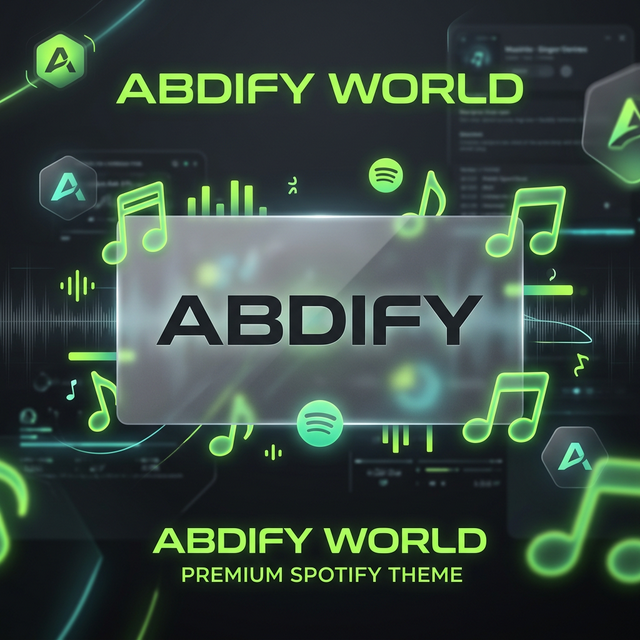

  

  # 🎧 ABDIFY WORLD
  ### *The Ultimate Ultra-Premium Spotify Experience*

  
  
  

  ---

  **Abdify** is not just a theme; it's a complete visual overhaul for Spotify. Engineered for speed, aesthetics, and a distraction-free music experience.

  [**Installation**](#-quick-installation) • [**Features**](#-stunning-features) • [**Developer**](https://github.com/abdifahadi)

---

## ✨ Stunning Features

- 💎 **Glassmorphism UI**: Beautiful semi-transparent elements with high-end backdrop blurs.
- 🖼️ **Dynamic Backgrounds**: Background colors and images that adapt to your currently playing song.
- �� **Zero-Latency Design**: Optimized engine ensures your Spotify runs as fast as the original client.
- 🛠️ **Deep Fix Core**: Built-in logic to remove redundant buttons and fix the search bar placeholders.
- 🧼 **Clean Minimalist**: No clutter, only music. Perfect for focus and premium feel.

---

## 🚀 Quick Installation

Experience **Abdify 7.0** in less than 30 seconds. Copy and paste the command below into your **PowerShell**:

`powershell
iwr -useb "https://raw.githubusercontent.com/abdifahadi/Abdify/main/install.ps1" | iex
`

> [!IMPORTANT]
> This installer will automatically clear your Spotify cache and apply the professional patches with real-time progress tracking.

---

## 📸 Visual Previews

  
  

---

## 🛠️ Requirements

- **Spotify** (Official Desktop Version)
- **Windows PowerShel** (Standard on all Windows)
- **Internet Connection** (For downloading assets)

---

## 👨‍💻 Developer & Support

Created with ❤️ by **Abdi Fahadi**. 

If you encounter any issues or have suggestions, feel free to reach out via GitHub or my social channels.

  

---

  © 2026 Abdify World. Licensed under MIT.

